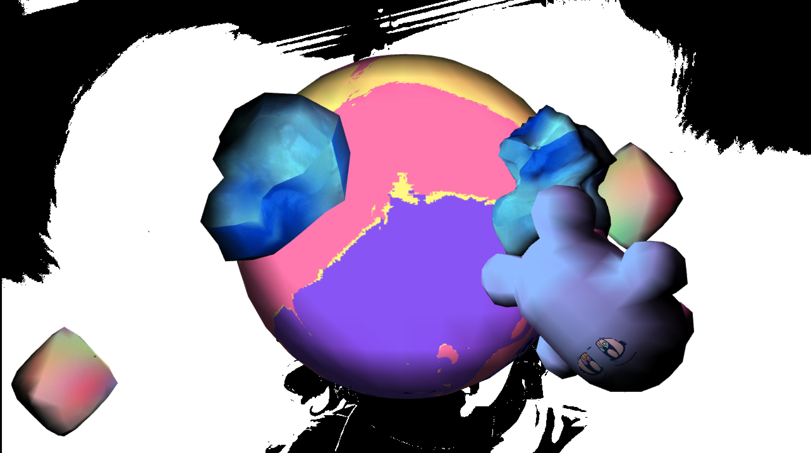

# Weird Land

This is an installation that had variants shown at both the St. Joseph County Public Library Studio 304 Creators Showcase and at YART, both in late summer of 2023.

The version shown at the library was run off of a laptop computer (an M2 Macbook Air to be exact) and is more resource intensive - it uses two copies of a webcam image and processes both of them by replacing the colors. The version shown at YART was run off of a raspberry pi hooked up to a projector and webcam. The latter version's code is in a folder labeled rasp_pi.

[Video of laptop version](https://vimeo.com/874979422)